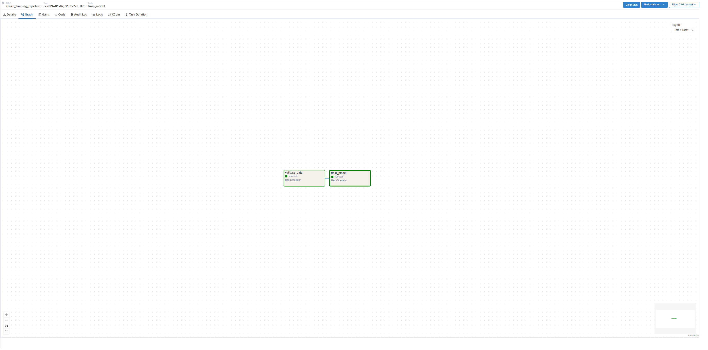
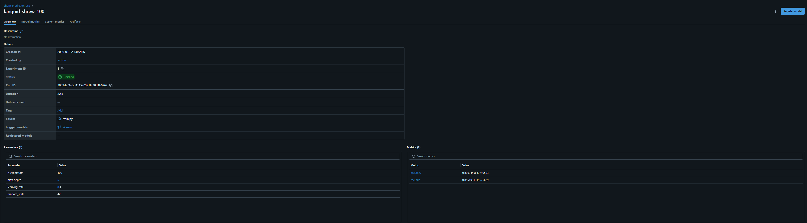
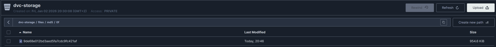
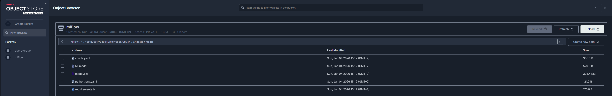
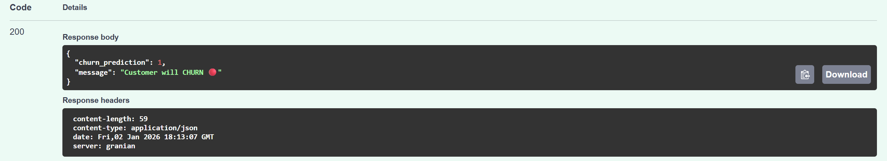

# 📘 Customer Churn Prediction Pipeline


## 💡 TL;DR — What this is

**Customer Churn Prediction Pipeline** is a production-grade MLOps system capable of data validation, model training, experiment tracking, and artifact storage using a containerized microservices architecture.

It automates the lifecycle of a classification model (XGBoost) to predict whether a customer will leave a service, ensuring high data quality via Evidently AI and full reproducibility via MLflow.

---

## 📂 Repository Layout
```
Churn_Prediction_Pipeline/
├── .dvc/
├── airflow/
│   └──dags/
│   └── plugins/
├── dags/
│   └── churn_training_pipeline.py  # Airflow DAG definition
├── data/
│   ├── raw/                        # Raw input data
│   └── reports/                    # Generated drift reports
├── docker/                         # Container configurations
│   ├── airflow/
│   │   ├── Dockerfile
│   │   └── requirements.txt
│   └── mlflow/
│       └── Dockerfile
├── images/
├── monitoring/
├── src/
│   ├── inference.py                # (FastAPI Service)
│   ├── train.py                    # Training logic & MLflow logging
│   └── validate.py                 # Data validation logic (Evidently)
├── tests/
├── .dvcignore
├── .env                            # Environment variables
├── .gitignore
├── docker-compose.yml              # Multi-service infrastructure
└── README.md                       # This file
```

---

## 💻 Tech Stack

### Core Components

- 🐍 **Python 3.10** - Main runtime
- 🤖 **XGBoost** - Classification algorithm
- 📊 **Pandas & Scikit-learn** - Data processing

### MLOps Infrastructure

- 🚀 **Apache Airflow** - Workflow orchestration
- 📈 **MLflow** - Experiment tracking & Model Registry
- 📦 **MinIO** - S3-compatible artifact storage
- 🛡️ **Evidently AI** - Data drift detection & validation
- 🐳 **Docker Compose** - Multi-container orchestration
- 🐘 **PostgreSQL** - Backend for Airflow & MLflow metadata
- 🦉 **DVC (Data Version Control)** - Versioning of large datasets & pipeline tracking

---

## 🧠 How It Works

### 🚀 Pipeline Orchestration (Airflow)

The entire workflow is managed by Apache Airflow. The DAG handles dependencies between data validation and model training tasks.


*Figure 1: Airflow DAG execution graph (Data Validation → Model Training)*

### 📊 Experiment Tracking (MLflow)

Model parameters, metrics, and metadata are automatically logged to the MLflow Server.

- **Algorithm:** XGBoost Classifier
- **Current Accuracy:** 80.62%
- **ROC AUC:** 0.8555


*Figure 2: MLflow UI displaying run metrics and parameters*

### 🗂️ Data Versioning (DVC + MinIO)

We strictly separate code from data. While Git tracks the source code and lightweight `.dvc` metadata files, the actual heavy datasets are versioned and stored in **MinIO**.

This ensures:
1.  **Reproducibility:** Every Git commit is linked to a specific snapshot of data.
2.  **Storage Efficiency:** Git repository remains lightweight.
3.  **Collaboration:** The team can pull the exact data version needed for any experiment using `dvc pull`.


*Figure: MinIO bucket `dvc-storage` containing hash-addressed data files managed by DVC.*

### 📦 Artifact Storage (MinIO)

MinIO securely stores the serialized model (`model.pkl`), environment dependencies, and artifacts.


*Figure 3: MinIO bucket structure showing saved artifacts*

### 🔮 Model Serving (FastAPI)

A standalone **FastAPI** microservice loads the latest production model from MLflow and exposes a REST API for real-time predictions. It automatically handles categorical encoding and data preprocessing.

- **Endpoint:** `/predict`
- **Port:** `8000`
- **Features:** Auto-reloading model, health checks, Swagger UI documentation.



### How to Predict (Example)

You can use the interactive **Swagger UI** at `http://localhost:8000/docs` or send a curl request:

```bash
curl -X 'POST' \
  'http://localhost:8000/predict' \
  -H 'Content-Type: application/json' \
  -d '{
    "gender": "Female",
    "SeniorCitizen": 0,
    "Partner": "Yes",
    "Dependents": "No",
    "tenure": 1,
    "PhoneService": "No",
    "MultipleLines": "No phone service",
    "InternetService": "DSL",
    "OnlineSecurity": "No",
    "OnlineBackup": "Yes",
    "DeviceProtection": "No",
    "TechSupport": "No",
    "StreamingTV": "No",
    "StreamingMovies": "No",
    "Contract": "Month-to-month",
    "PaperlessBilling": "Yes",
    "PaymentMethod": "Electronic check",
    "MonthlyCharges": 29.85,
    "TotalCharges": 29.85
  }
  ```

## Response:
```bash
{
  "churn_prediction": 1,
  "message": "Customer will CHURN 🔴"
}
```

---

## ⚡ Quickstart

### Prerequisites

- Docker & Docker Compose
- Git

### Start Infrastructure
```bash
# 1. Clone repository
git clone <repo-url>
cd Churn_Prediction_Pipeline

# 2. Build and start services
docker compose up -d --build

# 3. Check status
docker ps
```

### 🔗 Fast Links

| Service | URL | Credentials (Default) |
|---------|-----|----------------------|
| **Inference API (Swagger)** | [http://localhost:8000/docs](http://localhost:8000/docs) | None |
| **Airflow** | [http://localhost:8080](http://localhost:8080) | `airflow` / `airflow` |
| **MLflow** | [http://localhost:5000](http://localhost:5000) | None |
| **MinIO Console** | [http://localhost:9001](http://localhost:9001) | `minioadmin` / `minioadmin` |

---

## 🛠️ Make / Docker Commands

If you need to manage the lifecycle manually:
```bash
# Stop all services
docker compose down

# Stop and remove volumes (Clean slate)
docker compose down --volumes

# Rebuild specific service
docker compose up -d --build airflow

# View logs
docker compose logs -f airflow
```

---

## 🔓 License

MIT License

Copyright (c) 2026 Andriy Vlonha

Permission is hereby granted, free of charge, to any person obtaining a copy of this software and associated documentation files (the "Software"), to deal in the Software without restriction, including without limitation the rights to use, copy, modify, merge, publish, distribute, sublicense, and/or sell copies of the Software, and to permit persons to whom the Software is furnished to do so, subject to the following conditions:

The above copyright notice and this permission notice shall be included in all copies or substantial portions of the Software.

---

## 📞 Contact

📧 **Email**: andriy.vlonha.dev@gmail.com
