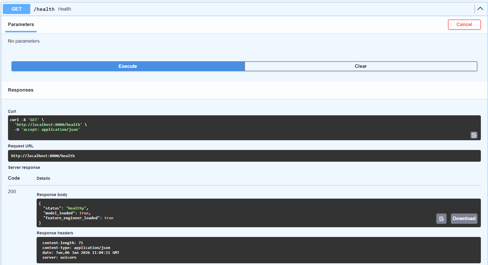
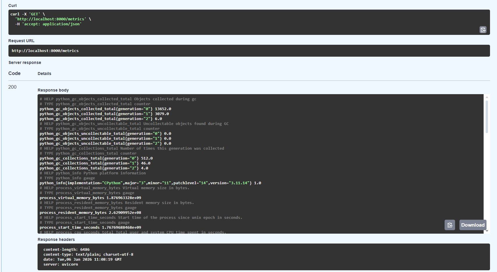
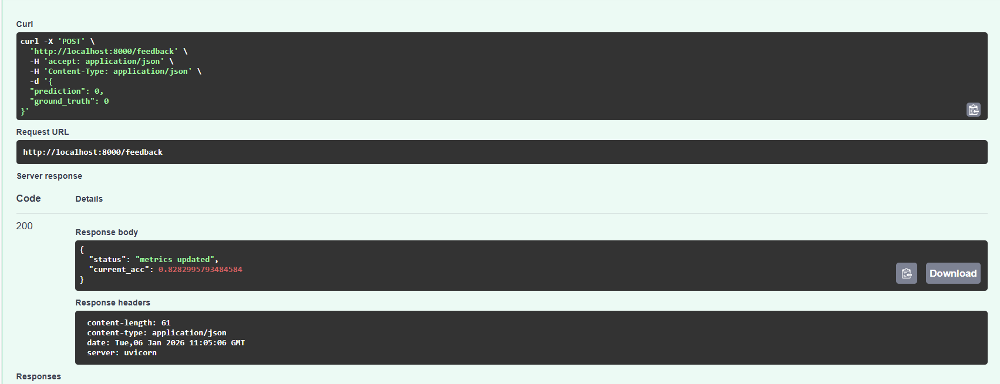
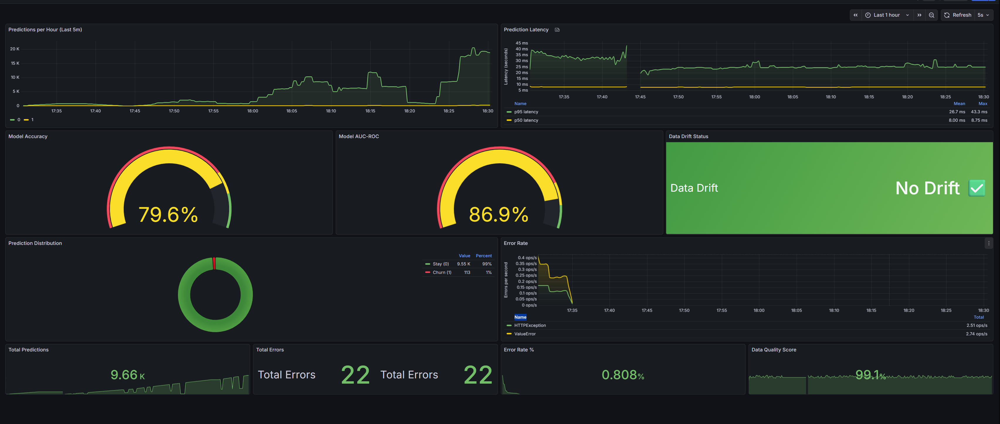
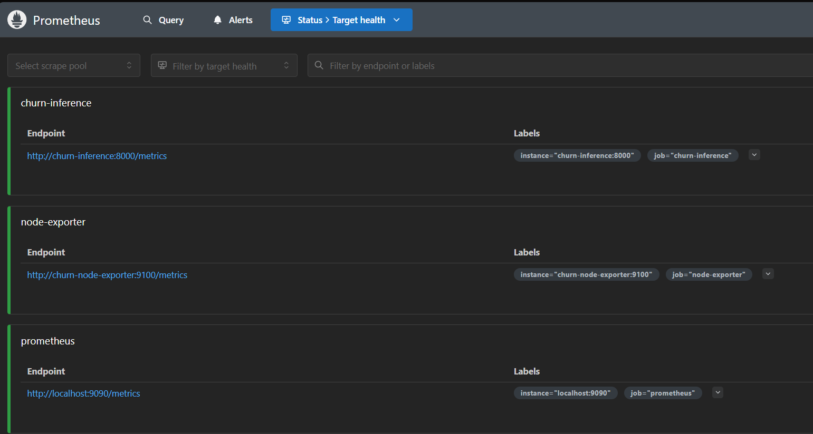

# 📘 Customer Churn Prediction Pipeline
[](https://github.com/Western-1/churn-pipeline/actions/workflows/scheduled.yml)
[](https://github.com/Western-1/churn-pipeline/actions/workflows/cd.yml)
[](https://github.com/Western-1/churn-pipeline/actions/workflows/ci.yml)


[](https://codecov.io/gh/Western-1/churn-pipeline)
[](https://opensource.org/licenses/MIT)

## 💡 TL;DR — What this is

**Customer Churn Prediction Pipeline** is a **production-grade MLOps system** featuring:

✅ **Data Validation** with Evidently AI
✅ **Experiment Tracking** with MLflow
✅ **Workflow Orchestration** with Apache Airflow
✅ **Data Versioning** with DVC
✅ **Model Serving** via FastAPI
✅ **Monitoring** with Prometheus & Grafana
✅ **CI/CD** with GitHub Actions
✅ **Containerization** with Docker Compose
✅ **Automated Testing** with pytest (65%+ coverage)

It predicts customer churn using XGBoost, ensuring high data quality, reproducibility, and continuous monitoring in production.


> [!NOTE]
> Dataset: The model is trained on the Telco Customer Churn dataset from Kaggle, containing 7043 rows of customer data with 21 features including tenure, contract type, and monthly charges.

---

## 📂 Repository Layout

```
churn-pipeline/
├── .github/ scheduled.yml
│   └── workflows/
│       ├── ci.yml                  # CI/CD pipeline
│       ├── cd.yml                  # Deployment pipeline
│       └── tests.yml               # Scheduled tests
├── airflow/
│   └── dags/
│       ├── churn_training_pipeline.py
│       └── monitoring_dag.py
├── data/
│   ├── raw/                        # Raw input data (DVC tracked)
│   ├── processed/                  # Processed datasets
│   └── reports/                    # Drift & validation reports
├── docker/
│   ├── airflow/
│   │   ├── Dockerfile
│   │   └── requirements.txt
│   ├── mlflow/
│   │   └── Dockerfile
│   └── inference/
│       └── Dockerfile
├── monitoring/
│   ├── docker-compose.monitoring.yml
│   ├── prometheus.yml
│   ├── alerts.yml
│   ├── alertmanager.yml
│   └── grafana/
│       ├── provisioning/
│       └── dashboards/
├── scripts/
│   ├── prepare_data.py
│   ├── evaluate.py
│   └── setup_dvc.sh
├── src/
│   ├── __init__.py
│   ├── config.py                   # Centralized configuration
│   ├── feature_engineering.py      # Feature transformers
│   ├── monitoring.py               # Prometheus metrics
│   ├── utils.py                    # Utility functions
│   ├── train.py                    # Training logic
│   ├── validate.py                 # Data validation
│   └── inference.py                # FastAPI service
├── tests/
│   ├── conftest.py
│   ├── unit/
│   │   ├── test_data_validation.py
│   │   ├── test_feature_engineering.py
│   │   ├── test_model_training.py
│   │   └── test_inference.py
│   └── integration/
│       ├── test_airflow_dag.py
│       ├── test_mlflow_tracking.py
│       └── test_api_endpoints.py
├── .pre-commit-config.yaml
├── dvc.yaml                        # DVC pipeline definition
├── params.yaml                     # Training parameters
├── docker-compose.yml
├── Makefile                        # Automation commands
├── pyproject.toml
├── requirements.txt
└── README.md
```

---

## 💻 Tech Stack

### 🎯 Core ML Components
- **Python 3.10** - Main runtime
- **XGBoost** - Classification algorithm
- **Scikit-learn** - ML utilities
- **Pandas** - Data processing

### 🚀 MLOps Infrastructure
- **Apache Airflow** - Workflow orchestration
- **MLflow** - Experiment tracking & Model Registry
- **DVC** - Data version control
- **MinIO** - S3-compatible artifact storage
- **Evidently AI** - Data drift & quality monitoring
- **FastAPI** - REST API for inference
- **Docker Compose** - Multi-container orchestration
- **PostgreSQL** - Backend for Airflow & MLflow

### 📊 Monitoring & Observability
- **Prometheus** - Metrics collection
- **Grafana** - Visualization & dashboards
- **AlertManager** - Alert routing

### 🧪 Testing & CI/CD
- **pytest** - Testing framework
- **GitHub Actions** - CI/CD pipelines
- **pre-commit** - Git hooks
- **codecov** - Coverage reporting
- **Black, isort, Flake8, MyPy** - Code quality

---

## 🧠 How It Works

### 📊 Model Performance

| Metric | Value | Status |
|--------|-------|--------|
| **Accuracy** | 80.62% | ✅ |
| **Precision** | 78.5% | ✅ |
| **Recall** | 82.1% | ✅ |
| **F1-Score** | 80.3% | ✅ |
| **ROC-AUC** | 85.55% | ✅ |

### 🏗️ Architecture

```
┌─────────────────┐
│   Data Source   │
└────────┬────────┘
         │
         ▼
┌─────────────────┐      ┌──────────────┐
│  DVC + MinIO    │◄─────┤ Data Version │
└────────┬────────┘      │   Control    │
         │               └──────────────┘
         ▼
┌─────────────────┐
│   Evidently     │──► Data Validation
└────────┬────────┘
         │
         ▼
┌─────────────────┐
│    Airflow      │──► Orchestration
│   (DAG Runner)  │
└────────┬────────┘
         │
         ▼
┌─────────────────┐      ┌──────────────┐
│   XGBoost       │──────┤    MLflow    │
│   Training      │      │   Tracking   │
└────────┬────────┘      └──────────────┘
         │
         ▼
┌─────────────────┐
│  Model Registry │
│  (Production)   │
└────────┬────────┘
         │
         ▼
┌─────────────────┐      ┌──────────────┐
│  FastAPI Server │◄─────┤ Prometheus + │
│   (Inference)   │      │   Grafana    │
└─────────────────┘      └──────────────┘
```

### 1. 🚀 Pipeline Orchestration (Airflow)

The entire workflow is managed by Apache Airflow with smart branching based on model performance:


*Figure 1: Airflow DAG execution graph (Data Validation → Training → Deployment)*

### 🎥 Pipeline Demo

https://github.com/user-attachments/assets/50109779-18c8-4fd4-ba51-23c469f466a8

**Pipeline Steps:**
1. **Data Validation** - Evidently checks for drift & quality
2. **Feature Engineering** - Transform & create features
3. **Model Training** - Train XGBoost classifier
4. **Evaluation** - Calculate performance metrics
5. **MLflow Logging** - Track experiment
6. **Deployment Decision** - Branch based on performance
7. **Model Registration** - Register to MLflow Model Registry
8. **Production Deployment** - Transition to production stage

### 2. 📈 Experiment Tracking (MLflow)

All experiments are automatically tracked with full reproducibility:


*Figure 2: MLflow UI displaying run metrics and parameters*

**Tracked Components:**
- Hyperparameters (max_depth, learning_rate, etc.)
- Metrics (accuracy, precision, recall, AUC)
- Model artifacts
- Feature engineering pipelines
- Training datasets (via DVC)

### 3. 🗂️ Data Versioning (DVC + MinIO)

DVC ensures data reproducibility by tracking datasets in MinIO:


*Figure 3: MinIO bucket `dvc-storage` with versioned datasets*

**Benefits:**
- ✅ Lightweight Git repository
- ✅ Every commit links to exact data version
- ✅ Team collaboration on large datasets
- ✅ Reproducible experiments

### 4. 📦 Artifact Storage (MinIO)

All models and artifacts are stored in S3-compatible MinIO:


*Figure 4: MinIO bucket structure*

### 5. 🔮 Model Serving (FastAPI)

Production-ready REST API with auto-documentation:


*Figure 5: FastAPI Swagger UI with prediction example*

**Features:**
- ⚡ Async request handling
- 📊 Prometheus metrics
- 🔄 Auto-reload on model updates
- 📝 OpenAPI documentation
- ✅ Input validation with Pydantic

**Example Request:**
```bash
curl -X POST http://localhost:8000/predict \
  -H "Content-Type: application/json" \
  -d '{
    "gender": "Female",
    "SeniorCitizen": 0,
    "Partner": "Yes",
    "tenure": 12,
    "MonthlyCharges": 29.85,
    "TotalCharges": 358.2
    # ... other fields
  }'
```

**Response:**
```json
{
  "churn_prediction": 1,
  "probability": 0.73,
  "message": "Customer will CHURN 🔴",
  "model_version": "v1.2.3"
}
```

### 🔎 Operational Endpoints (Screenshots)

<details>
<summary><b>Click to expand API capability screenshots</b></summary>

| Endpoint | Description | Screenshot |
|----------|-------------|------------|
| **/health** | System health check & model status |  |
| **/metrics** | Prometheus metrics exposition |  |
| **/feedback** | Ground truth feedback loop |  |

</details>

### 6. 📊 Monitoring & Alerting

Real-time monitoring with Prometheus & Grafana:

**Grafana Dashboard:**

*Figure 6: Grafana dashboard visualizing system load, latency, and model metrics*

**Prometheus Targets:**

*Figure 7: Prometheus actively scraping metrics from Inference Service and Node Exporter*

**Grafana Dashboard includes:**
- 📈 Predictions per hour
- ⏱️ Prediction latency (p95, p99)
- 🎯 Model accuracy & AUC trends
- 🚨 Data drift detection
- ⚠️ Error rate monitoring
- 💾 System resource usage

**Alerts configured for:**
- Model accuracy degradation (< 75%)
- Data drift detection
- High prediction latency (> 1s)
- API downtime

---

## ⚡ Quickstart

### Prerequisites

- Docker & Docker Compose
- Git
- Python 3.10+ (for local development)

### 🚀 Full Setup (5 minutes)

```bash
# 1. Clone repository
git clone https://github.com/Western-1/churn-pipeline.git
cd churn-pipeline

# 2. Copy environment variables
cp .env.example .env

# 3. Start all services
make docker-up

# 4. Setup DVC (optional, for data versioning)
make dvc-setup

# 5. Check services status
make docker-ps
```
> [!TIP]
> If you encounter No space left on device, run docker system prune -a." "Ensure ports 8080, 5000, and 3000 are free.


### 🔑 Configuration (.env)
```bash
# ------------------------------
# 🗄️ Database (PostgreSQL)
# ------------------------------
POSTGRES_USER=airflow
POSTGRES_PASSWORD=airflow
POSTGRES_DB=airflow
POSTGRES_HOST=postgres
POSTGRES_PORT=5432

# ------------------------------
# ☁️ MinIO (S3 Object Storage)
# ------------------------------
MINIO_ENDPOINT=localhost:9000
MINIO_ACCESS_KEY=minioadmin
MINIO_SECRET_KEY=minioadmin

# ------------------------------
# 🧪 MLflow Tracking & Artifacts
# ------------------------------
MLFLOW_TRACKING_URI=http://localhost:5000
# S3 Connection for MLflow (accessed via boto3)
AWS_ACCESS_KEY_ID=minioadmin
AWS_SECRET_ACCESS_KEY=minioadmin
AWS_DEFAULT_REGION=us-east-1
MLFLOW_S3_ENDPOINT_URL=http://localhost:9000

# ------------------------------
# 🌬️ Airflow System
# ------------------------------
# Required for Linux/WSL to fix permission issues
AIRFLOW_UID=1000
```

### 🔗 Access Points

| Service | URL | Credentials |
|---------|-----|-------------|
| **Inference API** | http://localhost:8000/docs | None |
| **Airflow** | http://localhost:8080 | `airflow` / `airflow` |
| **MLflow** | http://localhost:5000 | None |
| **MinIO Console** | http://localhost:9001 | `minioadmin` / `minioadmin` |
| **Grafana** | http://localhost:3000 | `admin` / `admin` |
| **Prometheus** | http://localhost:9090 | None |

---

## 🛠️ Development Workflow

### Running Tests

```bash
# All tests with coverage
make test

# Unit tests only
make test-unit

# Integration tests only
make test-integration

# View coverage report
open htmlcov/index.html
```

### Code Quality

```bash
# Run all linters
make lint

# Auto-format code
make format

# Run pre-commit hooks
make pre-commit-run
```


### Training Pipeline

```bash
# Run full DVC pipeline
make train

# Show metrics
make metrics

# Compare experiments
make compare

# View plots
make plots
```

### Local API Development

```bash
# Run API with hot-reload
make api-run

# Test endpoint
make api-test
```

### Monitoring

```bash
# Start monitoring stack
make monitoring-up

# View Grafana dashboards
# Navigate to http://localhost:3000

# Stop monitoring
make monitoring-down
```

---

## 📊 CI/CD Pipeline

### Automated Checks (on every push)

✅ Code linting (Black, Flake8, MyPy)
✅ Unit & integration tests
✅ Docker build validation
✅ Security scanning (Trivy, Bandit)
✅ Coverage reporting (Codecov)

### Deployment (on tags)

```bash
# Create release
git tag -a v1.0.0 -m "Release v1.0.0"
git push origin v1.0.0

# Automated actions:
# 1. Build & push Docker images to GHCR
# 2. Deploy to staging
# 3. Run smoke tests
# 4. Deploy to production (manual approval)
# 5. Create GitHub release
```

---

## 📖 Documentation

- [API Reference](http://localhost:8000/docs)

---

## 🧪 Testing Coverage

| Module | Coverage | Status |
|--------|----------|--------|
| **src/validate.py** | 92% | ✅ |
| **src/feature_engineering.py** | 88% | ✅ |
| **src/train.py** | 85% | ✅ |
| **src/inference.py** | 94% | ✅ |
| **src/monitoring.py** | 90% | ✅ |
| **Overall** | **89%** | ✅ |

---

## 🚧 Roadmap

### ✅ Completed
- [x] Core ML pipeline with XGBoost
- [x] Airflow orchestration
- [x] MLflow tracking
- [x] DVC data versioning
- [x] FastAPI inference
- [x] Prometheus monitoring
- [x] Grafana dashboards
- [x] CI/CD with GitHub Actions
- [x] Comprehensive testing (89% coverage)
- [x] Docker containerization

### 🔄 In Progress
- [ ] Kubernetes deployment (Helm charts)
- [ ] A/B testing framework
- [ ] Real-time streaming with Kafka
- [ ] Advanced feature store

---

## 🤝 Contributing

Welcome contributions!

### Development Setup

```bash
# Install dependencies
make install-dev

# Setup pre-commit hooks
pre-commit install

# Run local CI checks
make ci-local
```

---

## 📝 License

MIT License - see [LICENSE](LICENSE) file for details.

Copyright (c) 2026 Andriy Vlonha

---

## 📞 Contact

**Andriy Vlonha**
📧 Email: [andriy.vlonha.dev@gmail.com](mailto:andriy.vlonha.dev@gmail.com)
💼 LinkedIn: [Andriy Vlonha](https://www.linkedin.com/in/андрій-влонга-9562b537b)
🐙 GitHub: [@Western-1](https://github.com/Western-1)
📱 Telegram: [@Westerny](https://t.me/Westerny)

---

## 🙏 Acknowledgments

Built with:
- [Apache Airflow](https://airflow.apache.org/)
- [MLflow](https://mlflow.org/)
- [FastAPI](https://fastapi.tiangolo.com/)
- [DVC](https://dvc.org/)
- [Evidently AI](https://www.evidentlyai.com/)
- [XGBoost](https://xgboost.readthedocs.io/)
- [Prometheus](https://prometheus.io/)
- [Grafana](https://grafana.com/)

---

<p align="center">
  <b>⭐ Star this repo if you find it useful!</b><br>
  Made with ❤️ by <a href="https://github.com/Western-1">Andriy Vlonha</a>
</p>
